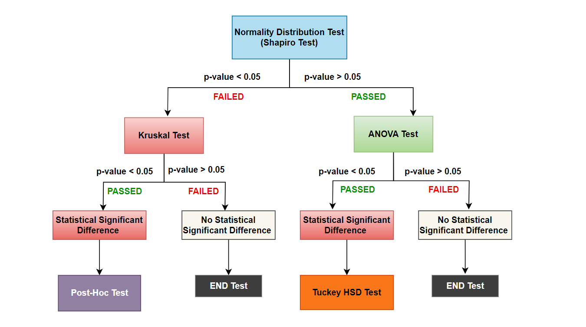

# Optimal Warehouse Location Recommender

This repository contains the implementation of a hybrid approach for recommending optimal warehouse locations for the delivery organization "We-Doo". The project combines several algorithms and statistical tests to achieve the most cost-effective and efficient warehouse placement.

## Table of Contents

- [Introduction](#introduction)
- [Features](#features)
- [Methodology](#methodology)
- [Results](#results)
- [Contributing](#contributing)

## Introduction

This project aims to determine the best warehouse locations within a town to minimize delivery costs for We-Doo, a startup that uses cargo bikes for daily deliveries. The project uses algorithms like Floyd Warshall, A*, and iterative integer programming, combined with statistical tests, to find and verify optimal solutions.

## Features

- Generate city maps and customer locations
- Generate and evaluate multiple warehouse locations
- Optimize delivery routes using a combination of algorithms
- Perform multi-simulation runs to determine optimal solutions
- Validate results using statistical tests such as ANOVA, Shapiro, Kruskal-Wallis, Tukey HSD, and Post-Hoc tests

## Methodology
Data Generation
City Map Generation: A graph with nodes representing possible locations and edges representing paths.
Warehouse Locations: Randomly generated within the city map.
Algorithms
Floyd Warshall: Computes shortest paths between all pairs of nodes.
A*: Heuristic algorithm to find optimal paths.
Iterative Integer Programming: Enhances route selection and handles exceptions.
Simulations
Conducted using the SimPy framework.
Parameters include cargo bike range, delivery times, and operational costs.
Statistical Tests

Shapiro Test: Checks for normal distribution of data.
Kruskal-Wallis H Test: Non-parametric test for statistical differences.
ANOVA: Tests for differences within group data.
Tukey HSD and Post-Hoc Tests: Identify specific group differences.

## Results
Detailed simulation results and statistical analysis can be found in the results directory.
Optimal warehouse locations are identified based on minimal delivery costs and validated through statistical tests.

## Contributing
Contributions are welcome! Please submit a pull request or open an issue to discuss any changes.

# Note:
The two separate folders that include the final code submission Jupiter notebook files are submitted. You may execute the code by choosing "restart and run all option" after unzipping the files. Since I have commented out the "multisimulation()" function after successfully generating and evaluating the results, it won't take long to run.
